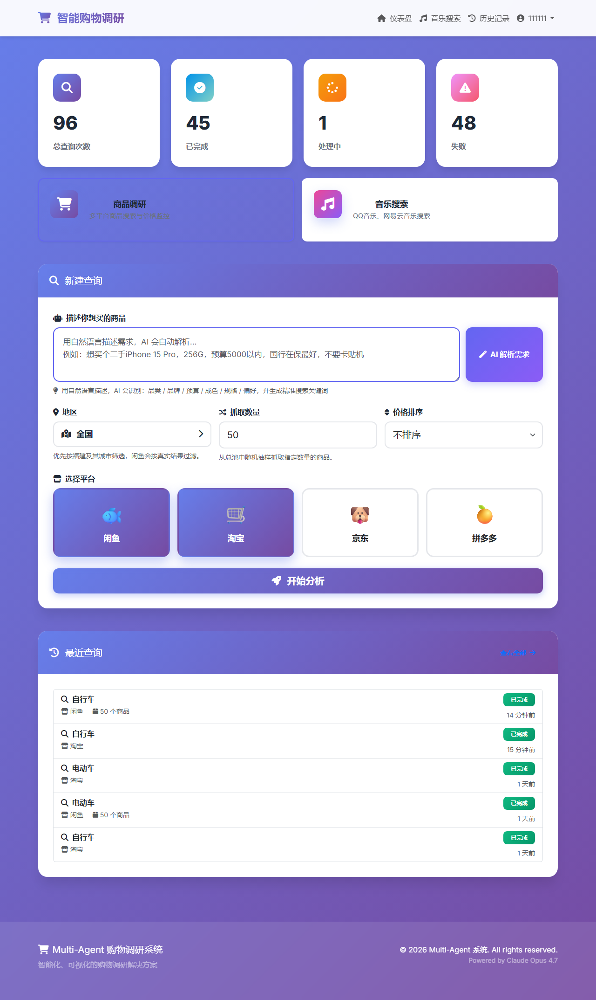
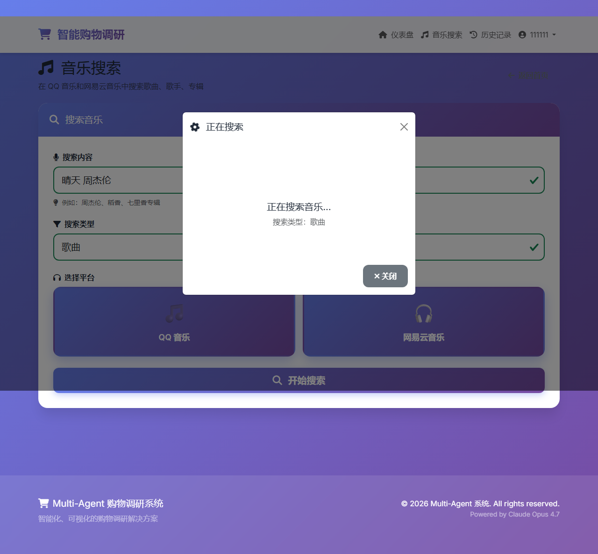
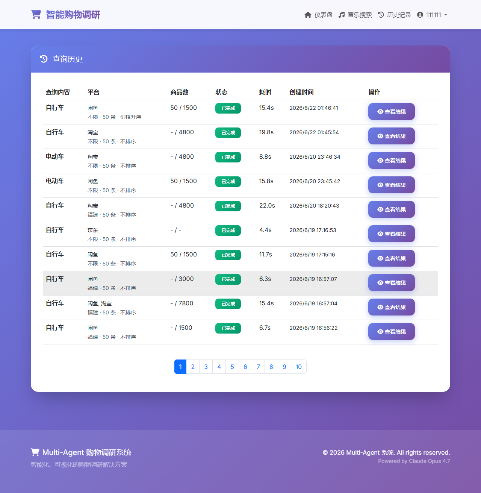

# Multi-Agent 购物调研系统

> 基于 Multi-Agent 架构的智能购物调研系统，支持多平台商品对比、评价分析、价格监控和可视化报告生成。附音乐搜索下载功能。


> **⚠️ 免责声明：本项目仅供学习研究使用，严禁将所获取数据用于商业用途。使用者须自行承担一切法律风险，作者不承担任何责任。**

---

## 截图预览

| Dashboard | 音乐搜索 |
|:---:|:---:|
|  |  |

| 历史记录 |
|:---:|
|  |

---

## 项目简介

这是一个基于 **Multi-Agent 协同架构**的电商商品调研系统，能够自动化完成：

✅ 多平台商品数据采集（闲鱼、淘宝、京东、拼多多）  
✅ 智能评价分析（情感分析、差评识别、刷评检测）  
✅ 价格监控与对比（性价比计算、历史追踪）  
✅ 可视化报告生成（Markdown + 8+ 种图表）

### 🏗️ 系统架构

```
┌─────────────────────────────────────────────┐
│         Multi-Agent Coordinator             │
│            (主协调器)                        │
└─────────────────┬───────────────────────────┘
                  │
      ┌───────────┼───────────┬───────────┐
      │           │           │           │
┌─────▼────┐ ┌───▼────┐ ┌───▼────┐ ┌───▼────┐
│ Agent 1  │ │Agent 2 │ │Agent 3 │ │Agent 4 │
│数据采集器│ │评价分析│ │价格监控│ │报告生成│
└──────────┘ └────────┘ └────────┘ └────────┘
```

### 🎯 核心功能

#### 1. 数据采集 (ScraperAgent)
- 支持平台选择（单选/多选）
- Mock 模式（测试）+ Real 模式（生产）
- 反爬虫策略（User-Agent 轮换、延迟控制）
- 数据缓存机制
- AI 意图解析结果透传到抓取层，预算和品类信息不再粗暴拼进搜索词
- 持久化浏览器 Profile 复用，可为闲鱼 / 淘宝 / 京东 / 拼多多保留登录会话
- 单平台 Harness / 诊断脚本，便于区分“平台风控或登录限制”和“代码逻辑问题”

#### 2. 评价分析 (ReviewAnalyzerAgent)
- **情感分析**：统计正面/中性/负面评价
- **差评识别**：5 大类关键词（质量、描述、服务、物流、严重问题）
- **刷评检测**：识别虚假评价模式
- **风险评估**：低/中/高三级风险等级

#### 3. 价格监控 (PriceMonitorAgent)
- **价格对比**：最低/最高/平均价分析
- **性价比计算**：综合评分 = (卖家评分 × 好评率 × 销量因子) / 价格
- **历史追踪**：SQLite 数据库存储价格历史
- **价格预警**：异常低价/高价提醒

#### 4. 报告生成 (ReportGeneratorAgent)
- **Markdown 报告**：完整的对比分析报告
- **8+ 种图表**：
  - 📊 价格对比柱状图
  - 🕸️ 卖家信誉雷达图
  - 🥧 情感分析饼图
  - 📊 性价比排名柱状图
  - 📦 平台价格箱线图
  - ☁️ 差评词云图（可选）
  - 📈 历史价格折线图（可选）

---

## 🚀 快速开始

### 环境要求

- Python 3.8+
- pip

### 安装依赖

```bash
cd design
pip install -r requirements.txt
```

### 运行示例

```bash
# 基本查询
python agents/multi-agent/main.py --query "iPhone 15 Pro"

# 指定平台
python agents/multi-agent/main.py --query "小米 14" --platforms xianyu taobao

# 只查询闲鱼
python agents/multi-agent/main.py --query "MacBook Air" --platforms xianyu
```

### 平台单独诊断

```bash
# 单独诊断淘宝
python scripts/diagnose_marketplace.py --platform taobao --query "100元以下的鞋子" --sample-count 10 --budget-max 100

# 单独诊断京东
python scripts/diagnose_marketplace.py --platform jd --query "100元以下的鞋子" --sample-count 10 --budget-max 100

# 单独诊断拼多多
python scripts/diagnose_marketplace.py --platform pdd --query "100元以下的鞋子" --sample-count 10 --budget-max 100
```

### 手动登录并复用会话

```bash
# 打开持久化浏览器窗口，手动完成登录
python scripts/bootstrap_marketplace_session.py --platform taobao

# 登录后再次诊断，后台抓取会复用 data/browser_profiles/taobao
python scripts/diagnose_marketplace.py --platform taobao --query "鞋子" --sample-count 10 --budget-max 100
```

### 查看结果

- **报告文件**: `reports/shopping_report_YYYYMMDD_HHMMSS.md`
- **图表文件**: `reports/charts/*.png`
- **日志文件**: `logs/*_YYYY-MM-DD.log`

---

## 📂 项目结构

```
design/
├── agents/                         # Agent 目录
│   ├── multi-agent/               # 主协调器
│   │   ├── coordinator.py         # 协调逻辑
│   │   └── main.py                # 命令行入口
│   ├── scraper-agent/             # Agent 1: 数据采集
│   │   ├── agent.py
│   │   ├── requirements.txt
│   │   └── README.md
│   ├── review-analyzer-agent/     # Agent 2: 评价分析
│   │   ├── agent.py
│   │   ├── requirements.txt
│   │   └── README.md
│   ├── price-monitor-agent/       # Agent 3: 价格监控
│   │   ├── agent.py
│   │   ├── requirements.txt
│   │   └── README.md
│   └── report-generator-agent/    # Agent 4: 报告生成
│       ├── agent.py
│       ├── requirements.txt
│       └── README.md
│
├── config/                         # 配置文件
│   ├── agent_config.json          # Agent 配置
│   ├── platform_config.json       # 平台配置
│   └── workflow_config.json       # 工作流配置
│
├── shared/                         # 共享资源
│   ├── utils/                     # 工具类
│   │   ├── logger.py              # 日志工具
│   │   └── api_client.py          # Claude API 客户端
│   ├── models/                    # 数据模型
│   │   └── product.py             # 商品/评价/卖家模型
│   └── constants/                 # 常量定义
│       └── keywords.py            # 关键词库
│
├── data/                           # 数据目录
│   ├── mock_data/                 # Mock 数据
│   │   ├── xianyu_products.json
│   │   └── taobao_products.json
│   ├── cache/                     # 缓存
│   └── database/                  # 数据库
│       └── price_history.db       # 价格历史
│
├── reports/                        # 生成的报告
│   ├── shopping_report_*.md       # Markdown 报告
│   └── charts/                    # 图表
│       ├── price_comparison.png
│       ├── seller_radar.png
│       └── ...
│
├── logs/                           # 日志文件
├── requirements.txt                # 依赖清单
└── README.md                       # 本文件
```

---

## ⚙️ 配置说明

### 1. 平台配置 (`config/platform_config.json`)

```json
{
  "platforms": {
    "xianyu": { "enabled": true, ... },
    "taobao": { "enabled": true, ... },
    "jd": { "enabled": false, ... },
    "pdd": { "enabled": false, ... }
  },
  "scraper_settings": {
    "mode": "mock",  // mock | real
    "max_products_per_platform": 20,
    "timeout": 30
  }
}
```

### 2. Agent 配置 (`config/agent_config.json`)

包含：
- Claude API 配置（base_url, api_key, model）
- 各 Agent 的路径和端口
- 通信协议设置

### 3. 工作流配置 (`config/workflow_config.json`)

定义 Agent 执行顺序和并行策略。

---

## 🎨 使用示例

### 示例 1：对比闲鱼和淘宝的 iPhone 15 Pro

```bash
python agents/multi-agent/main.py --query "iPhone 15 Pro" --platforms xianyu taobao
```

**生成的报告包含：**
- 价格对比表格
- 性价比排名
- 评价分析（情感分布、风险等级）
- 购买建议
- 5+ 种可视化图表

### 示例 2：查看生成的报告

```markdown
# 购物调研报告：iPhone 15 Pro

**生成时间**: 2026-06-17 14:30:00
**对比商品数**: 4
**分析平台**: xianyu, taobao

---

## 📊 价格对比分析

| 指标 | 数值 |
|------|------|
| 最低价 | ¥6800.00 |
| 最高价 | ¥9999.00 |
| 平均价 | ¥8074.50 |


...
```

---

## 🔧 技术栈

| 类别 | 技术 |
|------|------|
| 语言 | Python 3.8+ |
| HTTP 请求 | requests |
| 网页解析 | BeautifulSoup4, lxml |
| 数据可视化 | matplotlib, seaborn |
| 词云生成 | wordcloud |
| 中文分词 | jieba |
| 数据库 | SQLite3 |
| AI 模型 | Claude Opus 4.7 (via New API) |

---

## 🤖 Multi-Agent 协同原理

### 工作流程

```
1. 用户输入查询 → Coordinator 接收
                     ↓
2. Coordinator 调用 ScraperAgent
   → 并行抓取多个平台数据
                     ↓
3. Coordinator 并行调用:
   ├─ ReviewAnalyzerAgent (评价分析)
   └─ PriceMonitorAgent (价格监控)
                     ↓
4. Coordinator 调用 ReportGeneratorAgent
   → 生成 Markdown + 图表
                     ↓
5. 返回结果给用户
```

### Agent 通信

当前版本使用**直接函数调用**（`protocol: "direct"`）：
- 优点：简单、快速、适合本地运行
- 未来可扩展为 HTTP API 或消息队列

---

## 📊 性能指标

| 指标 | 数值 |
|------|------|
| 平均响应时间 | ~5-10 秒 |
| 支持商品数 | 20+ / 平台 |
| 图表生成数 | 5-8 张 |
| 报告长度 | 500-1000 行 |

---

## 🎯 适用场景

- ✅ **个人购物决策**：快速对比多平台商品
- ✅ **市场调研**：分析特定商品的市场行情
- ✅ **价格监控**：追踪商品价格变化
- ✅ **简历项目**：展示 Multi-Agent、AI 意图解析与工程化调研系统设计能力

---

## 🚧 待优化功能

- [ ] 真实爬虫模式（需解决反爬）
- [ ] 更多图表类型（散点图、热力图）
- [ ] 交互式 HTML 报告
- [ ] 定时监控和价格提醒
- [ ] 支持更多电商平台
- [ ] Agent 间 HTTP API 通信
- [ ] Docker 容器化部署
- [ ] 引入 Harness，建立 AI 解析与抓取质量的自动化评测机制

---

## 📝 开发日志

### v1.0.0 (2026-06-17)
- ✅ 完成 4 个 Agent 的基础实现
- ✅ 实现 Multi-Agent 协调器
- ✅ 支持 Mock 数据模式
- ✅ 生成 可视化图表
- ✅ 完成 Markdown 报告生成
